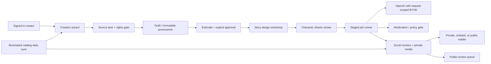

# Creator Platform Implementation Plan

## Purpose and product boundary

Turn **Create a Scroll** into a signed-in, deliberate creation studio for three
distinct inputs:

1. **My manuscript** — a file or pasted text the creator owns or is authorized
   to adapt.
2. **Project Gutenberg** — any selected Gutenberg edition, fetched from its
   canonical text record and retained with its exact bibliographic provenance.
3. **Write with me** — an original, AI-assisted story workshop that teaches
   story construction before drafting prose.

Every finished scroll is illustrated. The minimum visual package is one cover,
one chapter-opening image per chapter, and at least one anchored interior
illustration in every chapter. A creator may choose a larger image plan, but
may not choose text-only output in this product mode.

The creation experience must make the creator the accountable author/editor:
the title page names them, identifies the source/original author where
applicable, states the transformation, lists the writing and image model tiers,
and links to the source/provenance record. It must never represent a rewrite as
the original work.

This document describes the target implementation. It does not authorize
automatic remote import of non-Gutenberg sources, arbitrary copyrighted text,
or use of an API key belonging to the platform.

## Decisions and non-negotiable constraints

| Decision | Implementation rule |
| --- | --- |
| OpenAI credentials | Creator-owned keys only. A key is accepted for one active request, held only in request/process memory, forwarded only to the official OpenAI endpoints, then zeroed/discarded. Never persist it in SQLite, files, job payloads, logs, analytics, cookies, localStorage, sessionStorage, or URLs. |
| Login | Google OAuth identifies a creator and protects drafts/private scrolls. It does **not** supply or replace an OpenAI key. |
| Long operations | A durable job stores no provider credential. Provider-calling stages receive a new key only when the still-open browser/session explicitly resumes that stage. Non-provider work may run in the background. A restart or expired session pauses a provider stage and asks the creator to re-enter their key. |
| Rights | Require a lane-specific attestation before ingestion, an immutable provenance record, and automatic/manual review gates before public publication. Attestation is evidence, not a legal determination. |
| Gutenberg | Support any Gutenberg ID/title selectable through a first-party cached catalog/search adapter. Fetch only canonical `gutenberg.org` plaintext/UTF-8 releases, record the exact URL, EBook number, title, authors, rights text, checksum, retrieval time, and parser version. |
| Public sharing | All signed-in creators may keep private drafts and share unlisted links. Public publication is opt-in and reviewed. Non-subscribers may submit at most one new public listing request in a rolling seven days; subscribers use plan-defined limits. |
| Images | Character-sheet approval is mandatory before bulk art. Generation prompts must state the exact count of each named character in the scene and prohibit duplicate depictions unless the approved scene deliberately calls for them. |
| Illuminated letters | Treat the letters as licensed presentation assets. Display from a controlled asset service/proxy rather than exposing an enumerable raw file tree; record set/version/license in each scroll. Daily sync imports only catalog metadata and validated derivatives/permissions—not a public downloadable archive. |

## Current implementation: assets to retain and gaps to close

The current platform is a solid small synchronous prototype, but it must not be
extended in-place as though it already has accounts or durable workflow.

### Existing assets worth retaining

- `app/platform/create-studio.tsx` already clears the API-key input before it
  calls `/api/v1/stories`; it validates basic rights URLs and upload limits.
- `server/platform-server.mjs` already has exact CORS origins, loopback-only
  deployment, body/file/pixel limits, multipart staging, SQLite WAL,
  moderation before/after generation, media normalization, report handling,
  and two-phase media/database finalization.
- Generated artwork already has an internal character/style reference sheet,
  chapter hero placement, inline anchors, and moderation.
- The reader already understands story AST blocks, `chapter-hero` and `inline`
  images, provenance URLs, and theme IDs.

### Material gaps

1. **No identity or ownership authorization.** Anyone with a key can create and
   every unlisted story is readable by guessing/receiving its URL. There is no
   creator account, private visibility, editor role, subscription entitlement,
   session, or revocation.
2. **No source-lane model.** The API accepts only brief/pasted text. It cannot
   ingest a file, resolve Project Gutenberg, preserve a source edition, or
   express a rewrite/translation/reimagining transformation.
3. **No cost estimate or approval record.** The UI hard-codes `gpt-5.6-luna`,
   `gpt-image-2`, and low image quality, without provider price-table version,
   estimate, cap, approval timestamp, or tier choice.
4. **No staged authoring or character approval.** One model response writes the
   story, visual bible, character descriptions, and all image prompts at once;
   the current reference sheet is private and unreviewed. It also does not
   create a persistent cover asset despite the reader supporting one.
5. **No durable jobs/idempotency.** Creation holds one HTTP request open and
   `inFlightCreates` is memory-only. A restart loses work and a retry can spend
   the key again or create duplicate scrolls.
6. **Art policy is optional.** `none` and uploaded art with optional heroes are
   legal today; both contradict the mandatory visual minimum. Existing 1–24
   chapter / 100–2,000 word caps are prototype limits, not a book workflow.
7. **Public/private semantics are incomplete.** `unlisted` is shareable,
   not private; public listing has no per-user weekly quota or subscription
   policy.
8. **Theme inventory is static.** Only four bundled generic sets are exposed;
   there is no external catalog/version synchronization or access control.
9. **No title-page disclosure model.** `story` tables retain a short rights
   statement and sources but not creator identity, original authorship,
   transformation declaration, model/tier run, estimate, or approval record.
10. **Provider model naming needs confirmation.** Current code calls
    `gpt-5.6-luna` and `gpt-image-2`. Before release, place all model IDs,
    capabilities, output sizes, and prices in a server-owned provider catalog
    verified against the official OpenAI account/documentation; do not expose
    arbitrary user-provided model IDs.

## Target system shape



Split the existing `platform-server.mjs` into bounded modules while preserving
the same loopback Caddy topology:

- `auth/`: Google OIDC session validation, CSRF/session rotation, roles.
- `creator/`: draft validation, source adapters, estimates, ownership and
  entitlement checks.
- `jobs/`: persisted job orchestration, idempotency, leases, retry policy.
- `providers/openai/`: allowlisted models, JSON schemas, cost meter,
  request-scoped key use.
- `moderation/`: policy decisions, image/text checks, human-review records.
- `assets/`: private upload/object storage, derivative access checks,
  illuminated asset catalog proxy.
- `reader/`: revision-aware read endpoints and title-page disclosure data.

SQLite can support the first release, provided all writes use transactions and
the queue has a single service owner. Design repositories behind interfaces so
Postgres/object storage can replace them without changing public API shapes.

## Data model and migrations

Keep the current `stories`, `story_assets`, `moderation_events`, and `reports`
as legacy data. Add migration version 5+; do not mutate a live table without a
rehearsed migration and backup.

### Identity, access, plans

| Table | Required fields / constraints |
| --- | --- |
| `users` | `id`, `google_subject` unique, `email_normalized` encrypted or minimized, `display_name`, `role` (`creator`, `reviewer`, `admin`), `created_at`, `disabled_at`. Do not use email as identity. |
| `auth_sessions` | Opaque hashed token, `user_id`, `issued_at`, `expires_at`, `last_seen_at`, `csrf_secret_hash`, `revoked_at`, device label. Secure HttpOnly SameSite=Lax cookie contains only opaque token. |
| `subscriptions` | `user_id`, `provider`, `customer_ref`, `plan`, `status`, `current_period_end`, webhook event id unique. No card data. `plan` controls entitlements through a service, never UI trust. |
| `publication_quota_events` | `user_id`, `kind`, `requested_at`, `scroll_revision_id`; indexed `(user_id, requested_at)`. Count `public_listing_requested` in rolling seven days. |
| `creator_memberships` | `scroll_id`, `user_id`, `role` (`owner`, `editor`, `viewer`), unique pair. Owner is mandatory. |

### Source, transformation, and revision data

| Table | Required fields / constraints |
| --- | --- |
| `scrolls` | Stable `id`, non-reusable public slug, owner, `current_revision_id`, `visibility` (`private`, `unlisted`, `public`), listing state, timestamps/deleted_at. |
| `scroll_revisions` | Immutable `id`, `scroll_id`, version number unique per scroll, title/subtitle/AST snapshot, synopsis, creator credit, `source_record_id`, `transformation_record_id`, `production_run_id`, `title_page_json`, content hash, state. Never overwrite published content; edit creates next revision. |
| `source_records` | `lane` (`upload`, `gutenberg`, `ai_original`), source title, credited original author(s), language, canonical URL, source edition, rights basis, rights statement, submitted/retrieved timestamps, plaintext checksum, parser version, provenance JSON. For upload include original filename/MIME/size and encrypted/private storage ref; for Gutenberg include EBook ID, release URL, Gutenberg rights boilerplate and metadata snapshot. |
| `rights_attestations` | `source_record_id`, `user_id`, exact attestation version/text hash, selected basis, permission/license URL(s), confirmed_at, IP/session fingerprint hash, review state. Preserve append-only corrections. |
| `transformations` | `source_record_id`, type(s): `illustrate`, `modernize`, `translate`, `style_transfer`, `adapt`, `reimagine`, `new_ending`; source language/target language; reader-facing disclosure; structured instructions; approved plan hash. Rights policy can prohibit some choices by lane. |
| `story_designs` | `revision_id`, audience/age band, premise, promise, theme/moral, tone, POV/tense, setting rules, content boundaries, narrative arcs JSON, chapter beat map JSON, character bible JSON, continuity facts JSON, status/version. |
| `character_sheets` | `revision_id`, character key, text description, generated asset ref, creator decision (`pending`, `approved`, `changes_requested`), feedback, approved_at, sheet version. Must all be approved before bulk image job becomes runnable. |

### Production, assets, disclosure

| Table | Required fields / constraints |
| --- | --- |
| `production_runs` | `id`, `revision_id`, provider catalog version, writing model/tier, image model/tier, selected image style, output plan JSON, estimated cost JSON, estimate approved_at/by, actual known usage/cost JSON, status. The run stores models and prices, never keys. |
| `generation_jobs` | `id`, `production_run_id`, `stage`, state, idempotency key unique per owner/stage/input hash, attempt, input/output hashes, provider request correlation ID (not secrets), lease owner/until, retry_at, error code/redacted error, created/started/finished timestamps. |
| `story_assets_v2` | Revision-scoped asset, role (`cover`, `character_sheet`, `chapter_hero`, `inline`), chapter/block anchor, source (`generated`, `uploaded`, `external_licensed`), model/tier/version, prompt hash (not hidden prompt text if privacy policy requires), alt text, moderation state, file metadata/hash, credit/license/source URL. Enforce one `cover`; one `chapter_hero` for every final chapter; at least one `inline` per chapter. |
| `illuminated_catalog_sets` / `illuminated_catalog_glyphs` | Set/version/name/license/access state, glyph key, rendered asset fingerprint, source catalog fingerprint, availability and sync timestamp. Do not store a user-downloadable archive. |
| `title_page_disclosures` | Normalized revision snapshot used by reader: creator name, source/original author, source/edition link, rights basis, transformation statement, writing/image providers/models/tiers, illuminated set/version, illustration count, estimate/actual cost ranges, and generated date. |
| `review_cases` | Object type/id, policy reason, risk signals, state, reviewer/admin, decision/reason, timestamps. |

### State machines

**Scroll/revision**

```text
draft -> source_verified -> designed -> estimate_approved ->
character_review -> production -> moderation -> ready_private ->
unlisted | public_review -> public

Any state -> blocked_rights | rejected | archived
ready_private/unlisted/public -> new_revision (the old revision stays immutable)
```

**Job**

```text
queued -> leased -> running -> succeeded
                    | waiting_for_creator_key
                    | waiting_for_character_approval
                    | retry_scheduled -> queued
                    | failed_terminal
                    | cancelled
```

Provider stages transition to `waiting_for_creator_key` rather than retaining a
key after a response/session ends. Only a signed-in owner/editor can resume a
job with a new request-scoped `Authorization: Bearer` key.

## Creation wizard

The UI is a saved, resumable wizard—not a single large form. Autosave only
non-secret draft data. Keep the API-key field uncontrolled, `autoComplete=off`,
with no analytics/session recording; clear it immediately after copying to a
request-local variable. Explain this plainly in the UI.

### Stage 0 — sign in and project

- Require Google sign-in before opening a create draft. Show the creator name
  that will appear on the title page; permit a public pen name distinct from
  account identity.
- Choose private, unlisted, or **request public**. Explain: private is owner/
  invited editors only; unlisted has a secret capability link; public means
  review and community visibility.
- Query entitlement endpoint. A non-subscriber sees: “One public listing
  request every seven days; creating private/unlisted work is unaffected.”
  The server is authoritative and should reserve the quota transactionally only
  when an eligible public request moves to review.

### Stage 1 — choose a source lane

**A. My manuscript / file upload**

- Accept `.txt`, `.md`, `.docx`, `.epub`, and optionally `.odt` after
  server-side antivirus/content extraction. Reject PDFs initially (layout and
  scan/OCR ambiguity) unless a separately-reviewed text extraction route is
  added.
- Preview normalized text, detected chapters, word count, language, and
  discarded boilerplate. Store original privately, checksum the normalized
  source, and require confirmation that the creator owns/has adaptation rights.
- Ask origin, original author credit, copyright year/territory if known,
  permission/license record URL, and whether text contains personal data.

**B. Project Gutenberg**

- Provide title/author/EBook ID search with debounce against a daily cached
  Gutenberg metadata index. “Any” means any catalog entry, not an unrestricted
  URL fetch.
- On selection, show title, authors, languages, EBook ID, exact downloadable
  plaintext link, rights notice, known illustrations, and source word/chapter
  count. Fetch server-side only from allowlisted `gutenberg.org` HTTPS host
  after user confirmation. Lock the chosen release/checksum in `source_records`.
- Treat Gutenberg’s US-focused terms and edition-specific notice as a required
  reader-facing source disclosure. Do not promise worldwide public-domain
  status. For a non-US user/public listing, route ambiguous territorial cases to
  review.

**C. Write with me (AI original)**

- Begin with a short invitation, then use a child-friendly/adult-capable
  coaching conversation. The teacher asks one focused question at a time and
  explains why it matters; it offers examples but does not silently decide the
  whole book.
- Save each answer as structured design data, not one giant prompt. Provide a
  skip option with thoughtful defaults and an “I want surprises” setting that
  permits controlled novelty without breaking established continuity.

### Stage 2 — source treatment and transformation

For upload/Gutenberg lanes, creator chooses one or more bounded transformations:

- faithful illustrated edition;
- modern-language rewrite;
- translation (source and target language required);
- style adaptation (target style descriptors, never a living-author imitation);
- reimagining with changed setting/characters;
- alternate/new ending;
- abridgement for a defined audience/reading time.

The wizard produces a before-work **transformation plan**: what is preserved,
what changes, what is omitted, expected audience, and required attribution. The
creator must approve that plan. Show a strong warning and review gate when a
submitted work is not demonstrably public-domain/licensed or when a requested
rewrite is likely to be a non-transformative copy.

For all lanes, retain existing bounded leading-envelope cleanup as an advanced
import option only. It is disabled by default and must operate solely on a
verified opening editorial note; it must never strip brackets/angle brackets
inside prose.

### Stage 3 — the story-design workshop

This is the layered GPT-5.6 writing workflow. It is a series of reviewed
artifacts, each using strict JSON schema and the previous approved artifact as
context:

1. **Story promise** — audience, genre, emotional promise, length, content
   boundaries, theme/moral/question, tone, voice, point of view and tense.
2. **Characters** — desire, need, wound, flaw, strengths, voice, relationship
   web, change by ending, and visual differentiators. Never use a real person’s
   likeness without explicit rights.
3. **World and rules** — setting, period, constraints, magic/technology rules,
   recurring motifs, vocabulary/language guidance.
4. **Arcs** — external plot, internal character arc, relationship arc, and
   thematic/lesson arc. For younger writers include an optional “what do we
   want the reader to feel or understand?” panel rather than prescribing a
   moral.
5. **Chapter beat sheet** — setup, complication, choice, consequence, turning
   point, payoff/foreshadowing, character state before/after, and an image
   moment per chapter. Detect unearned changes, unresolved setups, duplicated
   beats, and continuity conflicts.
6. **Continuity bible** — canonical facts, timeline, locations, possessions,
   character appearances, relationships, open promises, and prohibited
   contradictions. Update it after each accepted chapter.
7. **Draft in batches** — write one chapter or a small coherent batch at a
   time. Each generation receives only the approved outline, relevant source
   segment, prior chapter summaries, relevant canonical facts, and a rolling
   style guide. Validate the output structurally and run a separate continuity
   critic before presenting it.
8. **Revision pass** — a non-writing critic evaluates pacing, character change,
   continuity, audience appropriateness, transformation fidelity, and theme;
   changes are presented as tracked editorial suggestions and must be accepted
   by the creator.

Prompt design rules:

- Developer messages state that source text and creator answers are quoted data,
  never instructions; model input/output is strict JSON, not HTML/Markdown.
- Use a high-quality GPT-5.6 writing tier selected from the allowlisted provider
  catalog. “Fast”, “balanced”, and “literary” tiers define model, reasoning/
  token budget, revision passes, and price-table version—not arbitrary names.
- Maintain a canonical fact ledger and require every chapter output to return
  `facts_added`, `facts_changed`, `open_threads`, and `continuity_risks`.
- Explicitly prohibit imitation of living authors and include a style-safe
  alternative (era/genre/technical traits rather than a person’s name).
- Keep the final prose distinct from teaching notes; no model commentary or
  authoring instructions appears in the reader.

### Stage 4 — visual direction and character approval

The creator chooses a visual brief (medium, palette, era, composition, mood,
accessibility constraints) and an image tier: `economy`, `standard`, or
`premium`, each mapped server-side to a current allowlisted image model/quality/
size/concurrency policy.

Before bulk art:

1. Generate a cover concept and a multi-character reference sheet (or one
   sheet per major character where readability requires it).
2. Present sheets with name, age range where relevant, physical/wardrobe
   details, signature props, palette, and relationship notes. User can approve,
   request textual changes, or regenerate a sheet. The selected version is
   stored and immutable for the production run.
3. Produce a per-chapter illustration map: cover + exactly one hero per chapter
   + at least one inline placement per chapter. Creator can change only safe
   bounded art instructions and placement, then approves the map.
4. Generate a small pilot (cover + first chapter hero + first inline) for
   quality/continuity approval before charging for all remaining images.

Every art prompt receives the approved relevant character-sheet asset and a
scene roster. Prompt compiler requirements:

```text
Scene roster: Mira (exactly one), Tomas (exactly one), no other people.
Depict each listed person exactly once. Do not repeat a face, body, or character
in the background. No crowds, mirrors, portraits, reflections, clones, or
duplicate figures unless explicitly listed in the approved scene roster.
If the scene needs a crowd, people must be distant, anonymous, non-identifying
silhouettes and must not resemble a named character.
```

The prompt compiler derives such language from structured roster counts, rather
than relying on free-form creator text. Image outputs are moderated and checked
for basic quality/duplicate-character risk; flagged images go back to the
creator for replacement, not silently into a public scroll.

### Stage 5 — estimate, safety, and explicit approval

Display the estimate before **every charge-bearing batch**: design, draft,
pilot images, remaining images, and optional revision/regeneration. An estimate
is not a quote; the UI must say the creator is responsible for their OpenAI
account and should configure OpenAI spend limits/budgets.

Required UI content:

- writing tier/model and max input/output token budgets per stage;
- image tier/model, size, quality, count, and reference-sheet count;
- estimated range, currency, provider price-table effective date/version,
  assumptions, and a worst-case cap;
- remaining stages and their separate estimates;
- an acknowledgement checkbox plus a one-time idempotency token.

Do not begin a provider stage until `estimate_approved_at` is set for the exact
input hash and price catalog version. If creator edits a cost-affecting field,
invalidate approval and recalculate.

### Stage 6 — finish, publish, and title page

Run final text/image moderation, rights gate, AST/asset invariants, accessibility
checks, and provenance rendering. The default completion is **private**.

The title page must include a compact, readable “About this scroll” disclosure:

- “Created by [pen name] using The Story Scrolls.”
- Original work / source edition, original author(s), canonical source link,
  source language, and rights/territory note.
- Transformation declaration (for example, “modern-language adaptation,
  illustrated; plot preserved; language and chapter structure revised”).
- Writing tool/model/tier and image tool/model/tier; illuminated set/version;
  optional link to an expanded production notes panel.
- Creator-approved character/art direction and a clear AI-generated-art label.

Disclosure is generated from immutable records, not free-form marketing copy.

## Cost estimator

Maintain a server-side, versioned `provider_price_catalog` table populated by an
operator tool from official pricing. The UI obtains only public tier labels and
the cost calculation response. Never accept price/model identifiers from the
browser.

Inputs to the estimate:

```text
writing:
  design_calls, outline_calls, draft_calls, revision_calls
  estimated_input_tokens_per_call, max_output_tokens_per_call
  selected writing tier/model, input/output token rates
images:
  character_sheet_count, cover_count (=1), chapter_hero_count (=chapters)
  inline_count (>= chapters), pilot_count, selected size/quality/model rate
other:
  moderation calls (shown as $0 if provider price is zero), retry allowance,
  tax/currency label if supplied by billing provider
```

Formula:

```text
writingEstimate = Σ(calls × ((inputTokens / 1_000_000 × inputRate)
                           + (maxOutputTokens / 1_000_000 × outputRate)))
imageEstimate   = Σ(imageCount × exact image SKU rate)
expectedTotal   = writingEstimate + imageEstimate
worstCase       = expectedTotal + approvedRetryAllowance
```

Record estimated and observed token/image usage from provider responses when
available. Do not promise actual cost accuracy, and stop a run when the
creator-approved worst-case cap would be exceeded. A request retry must reuse
the same idempotency key and should not be treated as permission for an
additional billable attempt without reapproval.

## API contract (v2)

All creator endpoints require an authenticated session and CSRF protection for
cookie-authenticated mutations. Responses use stable error codes; never echo
OpenAI keys, raw provider errors, prompts containing private manuscripts, or
unredacted source text.

| Endpoint | Purpose |
| --- | --- |
| `GET /api/v2/auth/me` | User, role, plan entitlement, current public-listing quota. |
| `POST /api/v2/auth/logout` | Revoke session. Google login/callback routes are provider-specific. |
| `POST /api/v2/creator/scrolls` | Create private draft and owner membership. Idempotency-Key required. |
| `GET/PATCH /api/v2/creator/scrolls/:id` | Read/update owner/editor draft. PATCH is version-conditional (`If-Match`). |
| `POST /api/v2/creator/scrolls/:id/source/upload` | Begin/complete constrained upload; server scans/extracts/normalizes. |
| `GET /api/v2/gutenberg/search?q=` | Cached metadata search; no arbitrary URLs. |
| `POST /api/v2/creator/scrolls/:id/source/gutenberg` | Select/import EBook ID and canonical text release. |
| `POST /api/v2/creator/scrolls/:id/rights/attest` | Append signed rights attestation. |
| `POST /api/v2/creator/scrolls/:id/transformations/plan` | Create/update structured transformation plan. |
| `POST /api/v2/creator/scrolls/:id/design/coach` | One bounded GPT-5.6 design exchange; key supplied request-scoped. |
| `GET/PATCH /api/v2/creator/scrolls/:id/design` | Retrieve/approve design, beat sheet, and continuity bible. |
| `GET /api/v2/illuminated-sets` | Available sets/preview derivatives/license metadata only. |
| `POST /api/v2/creator/scrolls/:id/estimate` | Server calculates exact stage estimate from protected catalog. |
| `POST /api/v2/creator/scrolls/:id/approvals` | Record estimate + plan approval for current hashes. |
| `POST /api/v2/creator/scrolls/:id/jobs` | Queue the next permitted stage. Requires Idempotency-Key; provider stages also require request-scoped `Authorization: Bearer`. |
| `GET /api/v2/creator/jobs/:id` | Owner/editor job state, redacted progress, estimate/usage. |
| `POST /api/v2/creator/jobs/:id/resume` | Supply a new request-scoped BYOK key to resume `waiting_for_creator_key`. |
| `POST /api/v2/creator/scrolls/:id/character-sheets/:sheetId/decision` | Approve/request changes. Bulk image stage cannot start without all required approvals. |
| `POST /api/v2/creator/scrolls/:id/publish` | Submit private/unlisted/public transition; server enforces rights, moderation, assets, quota, and entitlement. |
| `GET /api/v2/shared/:slug` | Public/unlisted reader payload. Private drafts require authenticated membership. |

Retire or version-gate `POST /api/v1/stories`; it cannot safely represent the
new workflow. Keep v1 read paths only until existing community stories migrate.

## Authorization, privacy, and access controls

- Google OIDC: use Authorization Code + PKCE, state/nonce validation, issuer/
  audience/expiry checks, server-side code exchange, and rotating encrypted
  client secret stored outside the repository. Restrict the initial allowed
  Google account only if the product is still closed beta; do not conflate that
  with public sign-up policy.
- Private revisions/assets: membership check on every reader/media request.
  Use opaque asset IDs or short-lived signed URLs; never expose the data-root
  path. A private asset response must be `Cache-Control: private, no-store`.
- Unlisted: generate a 256-bit random share capability separate from slug;
  store only a hash, support revoke/regenerate, and do not include in search,
  sitemap, previews, or referrers. A slug alone must not unlock it.
- Public: only `public` revision and approved listing status are indexable;
  content changes after publication create a reviewable revision.
- Collaboration: owner can invite editor/viewer; editor cannot transfer
  ownership, alter payment/subscription, delete origin provenance, or make a
  public submission without owner consent.
- Admin/reviewer actions require role checks, audited reason, and no raw BYOK
  visibility.

## Rights, safety, and moderation gates

1. **Upload lane:** require signed attestation and provenance. If a user claims
   `own`, still moderate and scan for obvious copied/copyrighted signals; route
   disputes or mismatches to review. Rights checkboxes are not enough to make
   public listing automatic.
2. **Gutenberg lane:** record all source facts and territorial note. Allow
   original-text display/illustration; modernizations/translations/reimaginings
   must carry an explicit transformation label and source attribution.
3. **AI-original lane:** prohibit prompts seeking copyrighted continuations,
   characters/worlds, living-author mimicry, public-figure likenesses without
   rights, or illicit sexual/exploitative material. Offer generic alternatives.
4. **Text and image moderation:** screen source, design prompts, generated text,
   character sheets, pilot art, and final art. Explicit sexual content involving
   minors, sexual exploitation, doxxing, extremist recruitment, malware,
   credible wrongdoing instructions, and illegal material are rejected. Ordinary
   fantasy violence, horror, romance, profanity, and age-appropriate difficult
   themes are allowed with audience/content labels.
5. **Publication review:** auto-safe material can become unlisted/private;
   public is additionally rights/provenance and policy reviewed. Reports hide
   a public revision pending review rather than destroy evidence.
6. **Audit and appeal:** store minimal redacted decision categories, policy
   version, and reviewer reason; offer creator appeal. Do not retain unnecessary
   sensitive manuscript excerpts in logs.

## Job processing, retries, and idempotency

### Provider-key-safe execution

The common “queue a job and put the API key in the payload” design is forbidden.
Instead:

1. Browser requests a specific stage with a one-time `Idempotency-Key`, signed
   session, approved estimate hash, and in-memory BYOK header.
2. Server creates/claims the durable job transactionally, performs that provider
   stage while the request is alive, and immediately removes the key reference
   when the request completes.
3. If the job needs a later provider call (or server restarts), mark it
   `waiting_for_creator_key`; the authenticated owner deliberately resumes with
   a newly entered key. Non-provider steps (parsing, image normalization,
   checksums, AST assembly, storage, catalog sync) can run autonomously.
4. Provider request correlation IDs, sanitized usage, output hashes, and retry
   state are persisted; raw key and raw authorization header are never logged.

For a future service-funded plan, introduce a separately consented platform
billing credential and job runner; do not retrofit it into BYOK.

### Reliability rules

- Unique `(production_run_id, stage, input_hash, idempotency_key)` prevents
  double work from reloads/double clicks. Return the existing job on replay.
- Lease jobs with `lease_until`; a reaper moves expired non-provider leases to
  `retry_scheduled`. Never automatically retry a potentially billed provider
  call unless the provider confirms the same idempotency key did not execute or
  the creator had pre-approved retry budget.
- Use atomic output staging: assets and AST are written to private staging,
  validated/moderated, then committed with revision/job state in one database
  transaction; orphaned media goes to quarantine as the current service does.
- Exponential backoff with capped attempts for network/5xx failures; terminal
  failure for policy/schema/rights failures. Persist redacted error code only.
- Progress events use authenticated SSE/polling. Do not send source prose,
  prompt text, API key, or provider trace data to browser telemetry.

## Illuminated-letter catalog integration

`illuminatedletters.corydev.com` is the current catalog source and
`illuminatedfonts.com` is the partner destination/brand. Implement an operator
configured daily sync (not browser-time scraping):

1. Fetch a signed/allowlisted catalog manifest over HTTPS with set ID, title,
   license, availability, glyph previews, version, checksum, and allowed use.
2. Verify checksum/signature and validate image MIME/pixel limits. Import only
   catalog metadata and permitted rendered derivatives into private/cache
   storage. Keep a sync log and preserve the prior catalog if the new one fails.
3. The UI may preview selected glyphs through authenticated/anti-enumeration
   image endpoints with rate limits and watermark/low-resolution previews where
   the partner requires it. Do not expose ZIP paths, directory indexes, original
   full-resolution glyph assets, or mass-download APIs.
4. At render/build time the server grants a narrow story/glyph derivative token
   or creates a protected derivative. Record the set and version in the scroll.
5. Add a visible partnership/about acknowledgment linking to
   `illuminatedfonts.com`, subject to partner-approved wording and license.

This is deterrence, not impossible copying prevention: anything a browser can
render can be captured. The enforceable layer is licensing, origin protection,
rate limits, non-enumerable derivative URLs, hotlink/CORS policy, and rapid
revocation—not pretending web images are technically unstealable.

## First two baseline user-generated scrolls

Create these only after the workflow and moderation gates are implemented; use
a dedicated test creator account and explicit title-page disclosures.

| Fixture | Lane | Purpose | Required baseline |
| --- | --- | --- | --- |
| **The Lanternmaker’s Map** | AI original | Exercises the full teaching flow: premise, a three-character arc, a kindness/curiosity theme, 8 short chapters, approved sheets, pilot, and final art. | Economy writing + standard art; one cover, 8 heroes, 8 inlines; private then unlisted. |
| **A Christmas Carol: A Clearer Road** | Gutenberg transformation | Exercises canonical import, rights/provenance, modern-language adaptation plan, author/source disclosure, transformation labeling, and publication review. | Balanced writing + standard art; one cover, one hero and one inline for every final chapter; public listing only after review. |

For each fixture, save a redacted run manifest: input hashes, source/canonical
URL (where relevant), tier catalog version, approved estimate, provider usage,
actual spend, job timings, error/retry counts, manual quality notes, and visual
duplication review. These establish real cost/latency baselines for the UI;
they are not a promise that other books cost the same.

## Testing and acceptance criteria

### Automated tests

- Unit: lane validation, file parser limits, Gutenberg metadata/release
selection, attestation versioning, transformation policy, title-page disclosure,
quota calculation, entitlement decisions, illuminated manifest verification,
and cost math/rounding.
- Security: OAuth state/nonce/PKCE, session fixation/logout/revocation, CSRF,
private/unlisted/public access matrix, asset authorization, no credential in
logs/database/job JSON/client storage, SSRF rejection, malicious filenames,
ZIP/EPUB bombs, prompt injection in source text, and concurrency/idempotency.
- Job tests: lease expiration, duplicate POST replay, restart recovery,
provider timeout with no unsafe automatic rebill, pause/resume requiring a new
key, atomic media/revision commit, orphan quarantine.
- Generation contract tests: every final chapter has exactly one hero and at
least one inline; one cover exists; all scene prompts carry roster counts and
duplicate-avoidance text; all character sheets approved before bulk image jobs;
continuity ledger rejects contradictions.
- Integration: mocked OpenAI and Gutenberg adapters, moderation outcomes,
public weekly quota, subscription entitlement seam, title-page disclosure,
reader rendering, accessibility, mobile and desktop wizard snapshots.
- End-to-end staging: Google OAuth callback with test credentials, upload,
Gutenberg selection, AI workshop, estimate acknowledgment, pause/resume, and
private/unlisted/public lifecycle.

### Manual quality gates

- Review two baseline scrolls at phone, tablet, desktop, narrow landscape, large
text, keyboard-only, and reduced-motion modes.
- Inspect every image for character identity/duplicate figures, legibility,
placement, caption/alt text, and visual continuity.
- Validate actual provider charges against estimate ranges and update the price
catalog/assumptions before opening the feature broadly.
- Perform rights/provenance review of every public baseline and a privacy review
that confirms no API key appears in server logs, browser storage, error reports,
or network replay data.

## Rollout plan

1. **Foundation:** Google OAuth/session service, membership/visibility model,
   v2 draft APIs, migration/backups, private asset access. Keep v1 community
   reader operational and read-only.
2. **Safe ingestion:** upload parser/scanner plus cached Gutenberg catalog and
   canonical fetch; rights/provenance/review UI; no automated generation yet.
3. **Design and estimates:** structured workshop, tier catalog, estimate
   approvals, title-page disclosure, entitlement/quota implementation.
4. **Generation pilot:** character sheets, pilot art, staged BYOK runner,
   mandatory visual invariants, moderation, resumption, and baseline fixtures.
5. **Public beta:** subscription provider webhook integration, reviewer queue,
   reports/appeals, daily illuminated sync, observability/redaction audit.
6. **Scale:** object storage/worker queue, optional service-funded plan,
   collaboration, translations, and controlled content discovery.

Use a feature flag per lane and per provider tier. Migrate old community stories
to a legacy read-only ownership state; do not falsely assign a Google owner or
retrofit incomplete provenance.

## External configuration required before enabling features

These are explicit deployment tasks, not code-only work:

- Create/configure a Google Cloud OAuth consent screen, verified production
  domain, redirect URI(s), OAuth client secret, permitted scopes (minimal
  `openid email profile`), and secure secret store. Review the Google branding
  and privacy-policy requirements.
- Choose a subscription/payment provider, create products/entitlements, secure
  webhook signing secret, configure tax/support/refund policy, and write the
  privacy/terms/acceptable-use/copyright/DMCA pages. The 1/week rule can launch
  before payment but subscription upgrades cannot.
- Confirm official OpenAI model IDs, availability, token limits, image sizes,
  quality settings, pricing, and API idempotency behavior for the intended
  account. Populate/version the provider price catalog and run staged smoke
  tests; use GPT-5.6 only where the account/official API supports it.
- Obtain a machine-readable, partner-authorized catalog contract from
  `illuminatedfonts.com` / `illuminatedletters.corydev.com`, including allowed
  storage/derivative/display behavior and revocation process. Do not scrape or
  expose the existing asset directory as a substitute.
- Choose malware scanning, encrypted backup/key-management, log redaction,
  monitoring, incident response, and human-review staffing/SLAs.
- Obtain legal/product review for regional copyright/public-domain handling,
  user-upload terms, AI disclosure, minor safety, and public sharing.

## Definition of ready

The expanded creator is ready for public use only when a signed-in creator can
complete all three lanes; approve a transparent estimate; build a structured
story with arcs and continuity; approve character sheets/pilot art; finish a
scroll satisfying cover/hero/inline invariants; see immutable provenance and
tool disclosure on the title page; keep it private/unlisted or request public
publication; and safely pause/resume without any stored OpenAI key. The two
baseline fixtures must pass the automated and human gates above before the
public-generation flag is enabled.
